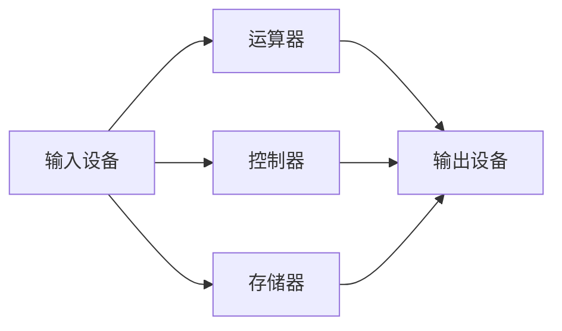
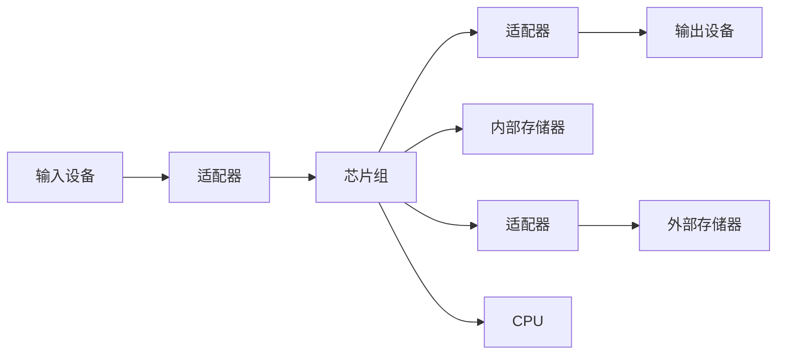

# 计概笔试

分值

填空题15空 15分：进制、存储、单位换算

选择题15单选：概念、运算

计算题18：数制转换、二进制、表达式

编码应用12分 2题

程序阅读12 3题

程序填空题 12分

算法流程图与编程12分

其他4分

### 计算机原理

##### 图灵机

存储带+控制器（读写头）

##### 进程的模拟地址空间

计算机基础架构：冯·诺依曼结构

CPU提供算法和控制，RAM和磁盘是记忆存储，键盘等于操作人员交互。

RAM：随机访问存储器：访问时间不随访问地址的不同而不同；易失特性

内存：随机地按指定地址对存储单元进行访问，特点是可以在任意时刻直接访问任意存储单元，不需要按顺序访问。

**局部性原理**包括**时间局部性**和**空间局部性**。时间局部性是指如果一个数据项正在被访问，那么在近期它很可能还会被再次访问；空间局部性是指如果一个存储单元被访问，那么它附近的存储单元也很可能会被访问。CPU 访问数据时，利用局部性原理可以提高访问效率，例如通过缓存机制来减少对主存的访问次数。

##### ASCII编码

7位数 2**7=128种

代码：10 new line; 13 carriage return; 32 space; **48**-57 0-9(**0: 00110000**); **65**-90 A-Z(**A: 01000001**); **97**-122 a-z(a: **01<mark>1</mark>00001**)

##### 其他

1. 进制转换

10--> 其它：整数部分连除，小数部分连乘（例： $0.493_{10}$ 转三进制。通过不断乘以 3 取整数部分）

例：0.634转换为八进制（保留四位小数）

0.634*8=5.072 --> 5

0.072*8=0.576 --> 0

0.576*8=4.608 --> 4

0.608*8=4.864 -->4

故结果为 (0.5044)_8

2的幂次转换：以2为中介系统（k位对1位）

##### 逻辑运算

与& 非~ 异或^：1100^1010=0110

计算机发展速度：摩尔定律：18个月CPU性能提升一倍价格下降一倍

计算机发展时代划分：电子管、晶体管、集成电路、大规模集成电路

**通信协议**栈：应用层（HTTP FTP SMTP DNS POP3 IMAP）表示层(SSL/TLS(加密协议) JPEG  MPEG) 会话层 传输层（TCP UDP）网络层（IP ICMP ARP）数据链路层(HDLC MAC Ethernet PPP) 物理层(USB Wi-Fi DSL Ethernet)

四层模型：应用层（ DNS 服务器的主要功能就是进行域名解析）、传输层、互联网层、网络接口层

三种互联网通讯协议的名称：<mark>TCP，UDP和HTTP</mark>。

发展历史：80年TCP/IP协议

1986 第一个互联网

IPv4: 32位二进制数

 IPv6: 128位

POP3：邮件接收协议

SMTP：邮件发送协议

FTP：文件传输协议

##### 硬件

冯诺依曼结构（见上）

实际设备结构组成：主板、CPU、接口、外设

**主板**（印刷电路板）是计算机硬件系统的核心载体，通过接口连接着 CPU（微处理器）、内存、硬盘、显卡等各种硬件设备，起到数据传输和供电等作用。

总线：

- 数据总线（Data Bus）
  - 数据总线用于在各个部件之间**传输数据**。它的位数（宽度）决定了一次能够传输的数据量。例如，一个 8 位的数据总线一次可以传输 8 位（1 字节）的数据。数据总线是双向的，既可以将数据从主存传输到 CPU（读取），也可以从 CPU 传输到主存（写入）。
- 地址总线（Address Bus）
  - 地址总线主要用于指定**传输存储单元**或 I/O 设备的**地址**。CPU 通过地址总线发送要访问的内存单元或 I/O 端口的地址信息。地址总线的位数决定了系统能够寻址的最大内存空间。例如，16 位的地址总线可以寻址的内存空间为字节（64KB）。地址总线是单向的，一般是从 CPU 向外传输地址信号。
- 控制总线（Control Bus）
  - **控制信息的传递（读、写）。**控制总线用于传输控制信号，协调各个部件的操作。这些控制信号包括读写信号、中断信号、总线请求和授权信号等。例如，当 CPU 要从内存读取数据时，会在控制总线上发出一个 “读” 信号，通知内存将指定地址的数据发送到数据总线上。控制总线的每一根线传输的信号方向根据具体的控制功能而定，有的是单向的，有的是双向的。

**适配器**：适配器通常是指用于连接和控制外部设备的硬件，比如显卡（图形适配器）、网卡（网络适配器）、声卡（声音适配器）等。这些适配器卡插入主板的插槽中，并通过特定的接口连接外部设备

存储器：（CPU里的）寄存器最快（其次内存，最慢硬盘），中间用缓存 （越快越小，越快越贵） **分层存储原理**：从上到下容量增大，速度变慢

##### 计算机组成

CPU（运算器+控制器）、主存、输入/输出子系统

CPU（中央处理单元，核心硬件设备，主要功能：执行程序）：**算术逻辑运算器、程序控制器**（分析、解释指令；控制其他部件）**、寄存器、中断处理器**（紧急意外情况处理；中断当前程序，调用外部新程序）

CPU、内存间由**总线（数据总线、地址总线、控制总线）**连接，（I/O）通过接口/控制器与总线链接，常见控制器有SCSI、火线、USB

CPU 寄存器 高速缓存 主存储器（内存） 外存储器（磁盘）

主存：存储单元的集合：RAM ROM

输入/输出（I/O）子系统的设备集合允许计算机与外界交流，存储程序和数据，即使在计算机已关机时也可以。输⼊/输出设备分成两⼤类：非存储设备和存储设备。⾮存储设备允许CPU/内存与外界通信;存储设备可以存储以后被检索的⼤量信息。存储设备被分成磁的和光的。

（忽略箭头方向）

**连接**

外围设备：端口和**适配器**连接

内部：总线（数据总线、控制总线、地址总线）

文件和文件系统来组织和管理存储在外存储设备上的信息

#### 软件

**系统软件**

**操作系统**（软硬之间……）（例：安卓、鸿蒙、Windows、macOS）：<mark>最重要（最基础 最核心）的软件</mark>

主要任务：内存管理、文件管理、资源管理、任务调度；管理软硬件资源，提供各类用户接口

**设备驱动程序**：面向硬件连接

面向软件开发：数据库、工具软件、软件开发环境

**语言处理程序**

**数据库管理系统**

**应用软件**……

程序：取指令、译码、执行

### 运算

#### 逻辑运算

原理：位模式存储

##### 位层次上的逻辑运算：

非 与 或 异或（XOR）

##### 模式层次上的逻辑运算：

n位

所有数求反：NOT

指定位复位：0 AND；置位：1 OR；反转（部分位求反）：1 XOR

#### 移位运算

逻辑移位、循环移位（不带符号）

算术移位（带补码，乘除2）

### 22笔试

1. CPU运算速度=时钟频率（主频） / 每个指令周期的时钟周期数
2. 逻辑真等价于非0整数

### 21笔试

1. 微型计算机的 CPU 由**寄存器，中断处理器，算术逻辑运算器和<mark>程序控制器</mark>**四个部件组成。根据冯·诺伊曼结构，计算机由**运算器，<mark>控制器</mark>，存储器，输入设备和输出设备**五个部分相互连接组成。
2. CPU 通过**数据总线，<mark>控制</mark>总线以及地址总线**和其它部件进行各种信息的传递。为了保证性能，数据总线的宽度应该与 CPU 字长一致。
3. 0 or 5 = 5
4. 验证码解决了对**用户密码**的暴力破解问题
5. 位=比特，bit（binary digit），8 bit = 1字节， Byte（B）
6. 图像的原始大小：
   ⼀幅1024×1024像素的图像，每个像素使⽤24位（即3字节）来表示颜⾊，那么整个图像的大小为：1024\*1024\*3/1000^2 (MB). 32位CPU：2^32**字节**的数据，可以储存2^32/(1(每张)*2^20)=2^12（张）=4096（张）
7. 操作系统的主要功能是：控制调度管理计算机软硬件资源、协调计算机运行，以增强计算机的处理能力、提供人机交互页面。处理器管理（CPU）、存储管理、设备管理、文件管理和作业（进程）管理。

### 08 笔试

1. **计算题**：有一种影像，人们对它的要求很高：影像的播放速度是每秒32帧图像，每帧图像的分辨率为2048×1536像素，其颜色系统是512色；而声音的采样频率则要达到65536Hz，采用双声道，每声道用4字节（Byte）存储采样值。请问，要保存10分钟这种原始影像，需要多大的存储空间？（5分）

   每秒钟影像：

   - 颜色编码：
     $
     2^5 * 2^{11} * 3 * 2^9 * 9/8B = 4 * 3 * 9 \text{ MB} = 108 \text{ MB}
     $

   - 每秒钟声音：

   ​	$2^{16} * 2 * 4B = 0.5 \text{ MB}$

   10分钟：

   ​	$10 * 60 * (108 + 0.5) \text{ MB} = 65100 \text{ MB} \approx 63.6 \text{ GB}$

### 23笔试

1. 矢量图形表示方法 位图
2. 程序控制器：每条指令执行完毕后都会检测是否出现**中断信号**，以能够处理紧急事件
3. **变量名**对应存储单元起始地址，**变量值**对应存储单元中的数据
4. 音乐存储时声音信号经过采样、离散化、编码
5. 存储程序原理：**数据和程序**被存放在主存里
6. 中文字符在不同编码方式下占用的字节数不同，例如在 GBK 编码中，一个汉字通常占用 2 个字节，但在 UTF - 8 编码中，汉字占用的字节数可能是 3 个字节或更多
7. **三元语句**：执行句1 if 条件 else 执行句2
8. 类型 注意
